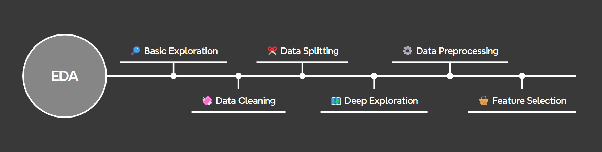

# 🏨 **Hotel No-Show Prediction ML Pipeline**


## 😀 Author

- Full Name: **Joel Ngiam Kee Yong**
- Email: [joelngiam@yahoo.com.sg](joelngiam@yahoo.com.sg)

## 🎯 Problem Statement

The objective of this project is to predict customer no-shows for a hotel chain using the provided dataset. A no-show occurs when a customer makes a booking but does not arrive at the hotel as planned, leading to revenue loss and operational inefficiencies for the hotel.

To address this issue, the project aims to:

1. Evaluate at least three machine learning models suitable for predicting no-shows.

2. Identify key factors contributing to no-show behavior through exploratory data analysis (EDA) and feature engineering.

3. Formulate actionable insights and recommendations that can help the hotel chain reduce expenses incurred due to no-shows, such as optimizing resource allocation, adjusting pricing strategies, or implementing targeted interventions.

By accurately predicting no-shows, this project seeks to empower the hotel chain to implement data-driven policies that minimize losses and improve operational efficiency.

## 🌐 Project Overview

This project aims to predict customer no-shows for a hotel chain using a modular, configurable, and reproducible machine learning pipeline. The objective is to help the hotel chain formulate data-driven policies to reduce expenses incurred due to no-shows.

The project includes:

- **Exploratory Data Analysis (EDA) 🔎📊🧩**: A detailed analysis of the dataset to uncover patterns, trends, and insights that influence no-show behavior.

- **End-to-End Machine Learning Pipeline (ML Pipeline) 🏭🤖🔮**: A fully automated machine learning pipeline that preprocesses the data, trains multiple models, evaluates their performance, and generates actionable reports.

The pipeline is designed to be **reusable**, **readable**, and **self-exlanatory**, enabling easy experimentation with different models, preprocessing steps, and hyperparameters.

### Folder Structure:

```
├── archives/              # Folder for inactive files and logs
├── assets/                # Images or visualization assets
├── data/                  # Location for datasets; auto-generated
├── models/                # Saved preprocessor and trained models; auto-generated
├── output/                # Results of model evaluations; auto-generated
├── src/                   # Python modules for the ML pipeline
│   └── utils/             # Utility functions for general EDA
│   └── pipeline.py        # Main executable for the pipeline
├── config.yaml            # Configuration file for the ML pipeline
├── eda.ipynb              # Exploratory Data Analysis (EDA) notebook
├── README.md              # This file
├── READ_ABOUT_ME.md       # Additional documentation
├── requirements.txt       # Dependencies for the project
└── reset.sh               # Bash script to reset the project
└── run.sh                 # Bash script to execute the entire ML pipeline
```

## 📋 Execution Instructions

1. Install dependencies

   ```bash
   pip install -r requirements.txt
   ```

2. [Optional] Manually download and place the dataset file into the `data/` folder. The following step does this automatically. Link for download: [https://techassessment.blob.core.windows.net/aiap-pys-2/noshow.db](https://techassessment.blob.core.windows.net/aiap-pys-2/noshow.db)

3. Run the ML pipeline by executing either of the following bash scripts

   ```bash
   bash run.sh            # Run the full ML pipeline
   bash run.sh --lite     # Run the pipeline in lite mode, for quick debugging of the pipeline
   ```

4. Experiment with the ML pipeline by modifying the `config.yaml` and `/src` files, then review the training logs in the `/archives` folder

5. [Optional] Reset the project

   ```bash
   bash reset.sh
   ```

## 🔎 EDA Workflow & Findings

The Exploratory Data Analysis (EDA) process is designed to systematically understand the dataset, identify patterns, and inform subsequent steps such as feature engineering and model selection in the ML pipeline. Instead of isolating univariate, bivariate, and multivariate analyses into separate sections, the EDA workflow is integrated into broader, purpose-driven stages that reflect the iterative nature of data exploration. Below is a visual representation that illustrates the key stages of the EDA workflow:

<div style="margin-bottom: 20px;">
    
</div>

For a detailed walkthrough of the EDA and its workflow, please refer to the `eda.ipynb` notebook.

Below is a brief summary of the most significant insights and key findings from the EDA:

**🔎 Target Variable Distribution:**

- The dataset exhibits class imbalance, with approximately X% of customers being no-shows.
- This imbalance was addressed during model evaluation by prioritizing metrics like precision, recall, and F1-score over accuracy.

**🔎 Features Distributions:**

- asda
- asd

**🔎 Data Quality Issues:**

- A small percentage of missing values were identified in certain features and handled using imputation techniques.
- Outliers in numerical features like `price` were analyzed but retained unless they distorted model performance.
- Accuracy, completeness, consistency, relevance, validity

**🔎 Key Predictors of No-Shows:**

- Features such as `booking_to_arrival_time`, `stay_duration`, and `platform` were found to have strong correlations with the target variable (`no_show`).
- Categorical features like `branch` and `room` also showed significant differences in no-show rates across categories.

**🔎 Feature Relationships:**

- Multivariate analysis revealed interactions between features.
- For example, customers who booked closer to their arrival date (`booking_to_arrival_time`) and stayed longer (`stay_duration`) were more likely to show up.

**🔎 Actionable Insights:**

- Customers booking through specific platforms or during certain months exhibited higher no-show rates.
- These insights can guide targeted interventions, such as offering discounts or reminders to reduce no-shows.

These findings informed the preprocessing steps, feature engineering, and model selection in the pipeline.

## 🏭 Pipeline Design

The machine learning pipeline employs a **sequential processing** methodology, where tasks are executed in a linear order, with each stage depending on the output of the previous one. This approach ensures a straightforward and predictable workflow, making the pipeline intuitive to follow and easier to debug. By completing one task before moving to the next, we maintain a clear and logical progression throughout the pipeline.

Given the relatively small size of the dataset, sequential processing is sufficient and computationally efficient. However, for larger-scale projects or big data applications, **parallel processing** could be considered to optimize resource utilization and reduce execution time. While parallel processing offers performance benefits, it introduces additional complexity, requiring careful orchestration to manage data dependencies effectively.

Below is a illustrative representation of the steps in the pipeline:

<div style="margin-bottom: 20px;">
    
</div>

The machine learning pipeline is designed to be **modular**, **interpretable**, and **scalable**, enabling easy experimentation with different models, preprocessing steps, and hyperparameters. Below is a detailed breakdown of the logical steps involved in the pipeline:

### 1. 📥 Data Loading:

- Load the dataset from `data/noshow.db` using SQLite and convert it into a Pandas DataFrame.
- Validate the database path and ensure the required table exists to prevent runtime errors.
- Automate data retrieval to make the pipeline self-contained and executable without manual intervention.

### 2. 🧼 Data Cleaning:

- Validate data integrity by checking and addressing for duplicates and inconsistencies.
- Remove irrelevant features that do not contribute to predicting no-show behavior.
- Ensure all columns have appropriate data types to prevent preprocessing and modeling issues.
- Convert categorical columns to a consistent format (e.g., `category` dtype) for memory efficiency.
- Handle missing values by imputing placeholders and later addressing them during data preprocessing with information from training set only.
- Resolve data issues and identify systemic problems to provide feedback to the operational team for future improvements.

### 3. 🔧 Data Preprocessing:

- Split the data early using a stratified train-test split to preserve the class distribution of the target variable, ensuring both sets are representative of the imbalanced dataset.
- Use an 80%-20% split to allocate sufficient data for training and evaluation while maintaining robustness.
- A 20% test split strikes a balance between having sufficient data for training and evaluating model performance on unseen data.
- Perform advanced cleaning steps, including imputing missing values, removing outliers, and addressing inconsistencies based on insights from the training set only during EDA.
- Conduct feature engineering to create new, meaningful features and transform existing ones, enhancing interpretability and predictive power (e.g., deriving domain-specific synthetic features).
- Normalize numerical features using standard scaling to improve performance for gradient-based models and ensure consistent feature ranges.
- Encode categorical variables using techniques like One-Hot Encoding to ensure compatibility with machine learning algorithms.
- Perform feature selectiong using various techniques and remove features with excessive noise, irrelevance, or low variance to improve model efficiency and performance.
- Separating preprocessing and training enhances transparency and simplifies debugging, as each step can be independently validated. Using separate functions allows greater flexibility in modifying individual components (e.g., swapping scalers or encoders) without affecting the entire pipeline. This approach ensures reproducibility and consistency across different stages of the project.

### 4. 🤖 Model Training:

- Train multiple machine learning models to identify the best-performing algorithm for the no-show prediction task.
- Perform hyperparameter tuning using `GridSearchCV` to exhaustively search through specified parameter grids and find the optimal configuration for each model.
- Optionally switch to `RandomizedSearchCV` via the `config.yaml` file for faster exploration of hyperparameter spaces, especially when computational resources are limited.
- GridSearchCV is preferred for fine-tuning after identifying promising hyperparameter ranges using Randomized Search.
- Save the best-trained models along with their training time and size for comparison and future use.

### 5. 📊 Model Evaluation:

- Assess models on the test set to simulate real-world performance on unseen data, ensuring reliable generalization.
- Evaluate model performance using a combination of metrics and visualizations to ensure a comprehensive understanding of strengths and weaknesses.
- Use cross-validation during training to enhance robustness and minimize overfitting.
- Save evaluation results and visualizations to a dedicated output directory for easy review and comparison.

## 🛠️ Feature Processing

The following table summarizes how each feature in the dataset was processed to prepare it for machine learning modeling. These transformations aim to improve model performance, ensure compatibility with algorithms, and reduce noise while preserving meaningful patterns in the data.

For a detailed explanation of each feature's processing and rationale, please refer to the `eda.ipynb` notebook.

| Category    | Feature             | Source | Processing                               | Rationale / Remarks                   |
| ----------- | ------------------- | ------ | ---------------------------------------- | ------------------------------------- |
| Identifiers | `booking_id`        | 🌱     | ❌                                       | No predictive value                   |
| Target      | `no_show` ⭐        | 🌱     | Unchanged                                |                                       |
| Categorical | `branch`            | 🌱     | Converted to `category` type             |                                       |
|             | `booking_month`     | 🌱     | Converted to `int` type                  |                                       |
|             | `arrival_month`     | 🌱     | Converted to int                         |                                       |
|             | `arrival_day`       | 🌱     | Converted to int                         |                                       |
|             | `checkout_month`    | 🌱     | Converted to int                         |                                       |
|             | `checkout_day`      | 🌱     | Converted to int                         |                                       |
|             | `country`           | 🌱     | One-hot encoded                          |                                       |
|             | `first_time`        | 🌱     | Binary encoded manually                  | This is a binary feature              |
|             | `room`              | 🌱     | Missing values removed; One-hot encoded  |                                       |
|             | `platform`          | 🌱     | One-hot encoded                          |                                       |
|             | `currency_type`     | ⚙️     | One-hot encoded                          |                                       |
|             | `stay_category`     | ⚙️     | One-hot encoded                          | Short, mid-term and long              |
|             | `has_children`      | ⚙️     | One-hot encoded                          |                                       |
|             | `total_pax`         | ⚙️     | One-hot encoded                          |                                       |
| Numerical   | `price`             | 🌱     | ❌                                       | Consists of both USD and SGD amounts  |
|             | `num_adults`        | 🌱     | One-hot encoded                          |                                       |
|             | `num_children`      | 🌱     | ❌                                       | Used to create `has_children` feature |
|             | `price_in_sgd`      | ⚙️     | Missing values imputed; outliers removed |                                       |
|             | `months_to_arrival` | ⚙️     | Normalized                               |                                       |
|             |                     |        |                                          |                                       |

**└── Summary:** 21 features processed (12 original, 8 engineered). 2 features dropped. 18 features left.

**└── Legend / Notes:**

- ⭐: Target variable.
- 🌱: Original feature from the raw dataset.
- ⚙️: Derived or engineered feature created during preprocessing.
- ❌: Feature dropped from the dataset due to irrelevance, redundancy, or lack of predictive power.
- Kindly note that the 'Category' column refers to the final data type of the corresponding feature, and not the original data type.

## 🤖 Candidate Models

The selection of machine learning models for predicting customer no-shows was guided by the following key considerations:

### **✒️ Selection Criteria**:

- **Binary Classification:** The target variable (`no_show`) is binary (0 = Show, 1 = No-Show), making classification algorithms like Logistic Regression, Random Forest, XGBoost, and LightGBM particularly suitable.

- **Structured/Tabular Data:** The dataset comprises structured data with mixed feature types. Tree-based models such as XGBoost, Random Forest, and LightGBM are highly effective for such datasets due to their ability to handle mixed data types, capture non-linear relationships, and manage feature interactions.

- **Scalability:** With over 70,000 records, scalability is crucial. Models like XGBoost and LightGBM are optimized for large datasets and can efficiently handle high-dimensional data without significant increases in computational cost.

- **Interpretability:** While performance is a priority, interpretability remains important for deriving actionable insights. Feature importance scores help explain model predictions, ensuring transparency and trustworthiness.

### **🤖 Selected Models**:

- **`Logistic Regression`**: Logistic Regression is a simple and interpretable model that works well for binary classification problems. It is computationally efficient and scales well with large datasets and provides a baseline performance to compare against more complex models. Additionally, feature importance can be derived from the coefficients, which helps in understanding the impact of each feature on the target variable.

- **`Random Forest`**: Random Forest is an ensemble method that builds multiple decision trees and aggregates their predictions. It handles non-linear relationships and interactions between features effectively and is robust to overfitting due to bagging (bootstrap aggregating) and random feature selection. Random Forest works well with both numerical and categorical features and provides feature importance scores, which are useful for identifying key predictors. However, its training time can be longer compared to simpler models, especially with large datasets or deep trees, and it is less interpretable than Logistic Regression.

- **`XGBoost`**: XGBoost is a gradient boosting algorithm that builds trees sequentially, optimizing for errors made by previous trees. It performs exceptionally well on structured/tabular data and supports regularization (L1/L2 penalties), which helps prevent overfitting. XGBoost is faster than Random Forest for large datasets due to its optimized implementation and ability to handle sparse data. It also handles imbalanced datasets well and provides feature importance scores and SHAP values for interpretability. While it scales well with large datasets, it is slightly less interpretable than Logistic Regression.

- **`LightGBM`**: LightGBM is another gradient boosting framework that is optimized for speed and memory efficiency, especially on large datasets. It uses novel techniques such as Gradient-based One-Side Sampling (GOSS) and Exclusive Feature Bundling (EFB) to reduce training time without sacrificing accuracy. LightGBM handles categorical features natively and efficiently manages large datasets with millions of rows and high-dimensional feature spaces. Like XGBoost, it supports regularization (L1/L2 penalties) to prevent overfitting and provides feature importance scores and SHAP values for interpretability. LightGBM is often faster than XGBoost due to its histogram-based approach and optimized tree construction. However, like other advanced models, it is slightly less interpretable than Logistic Regression.

### **❓ Why not other models?**:

- **`Neural Networks`**: Neural networks are less suitable for structured/tabular data, especially when simpler models like XGBoost and LightGBM already deliver strong performance with lower computational costs. They excel in scenarios involving unstructured data (e.g., text, images) or highly complex patterns, which this dataset does not exhibit. Additionally, neural networks demand significantly more computational resources and time, creating an opportunity cost: the same resources could be allocated to faster, interpretable models that achieve comparable or better results. Given the excellent performance of tree-based models here (see below), neural networks are unnecessary and inefficient for this task.

- **`Support Vector Machines (SVM)`**: SVMs are computationally expensive for large datasets and may not scale well to 70k+ records. While effective for small to medium-sized datasets with clear decision boundaries, SVMs are not practical for this use case.

- **`K-Nearest Neighbors (KNN)`**: KNN is also computationally expensive for large datasets, and its performance degrades with high-dimensional data (curse of dimensionality). KNN computes distances between the query point and all training points, making it computationally expensive as the dataset grows. Training time increases significantly with larger datasets, especially if there are many features.

### **Model Selection Summary**:

In summary, Logistic Regression serves as a baseline model to establish a performance benchmark, while Random Forest , XGBoost , and LightGBM are chosen for their ability to handle complex relationships and large datasets efficiently. Models like XGBoost and LightGBM are prioritized for their scalability and optimization for large datasets, ensuring computational efficiency without compromising performance. While advanced models like XGBoost and LightGBM provide excellent predictive performance, interpretability is maintained through feature importance scores and SHAP values, allowing for a deeper understanding of the factors driving predictions.

## 📊 Model Evaluation

The evaluation of machine learning models in this project is designed to align with the business goals of predicting customer no-shows while addressing the challenges posed by an imbalanced dataset. To ensure that the chosen metrics and visualizations provide actionable insights, we prioritize methods that balance interpretability, fairness, and robustness.\

### Evaluation Metrics:

1. **Accuracy**

   - While accuracy provides a general sense of overall correctness, it serves as a baseline metric to assess the model's performance on balanced subsets of the data.
   - However, due to the class imbalance (more "Show" instances than "No-Show"), accuracy alone is insufficient for final model selection.

2. **F1-Score**

   - The F1-score balances precision and recall, providing a single metric that reflects the model's ability to accurately detect no-shows without overly favoring either metric.
   - This is particularly important for imbalanced datasets, where optimizing one metric at the expense of the other can lead to suboptimal outcomes.
   - Precision ensures that when the model predicts a no-show, it is likely correct. This minimizes false alarms, which could lead to unnecessary resource allocation or interventions, such as overbooking or offering discounts.
   - Recall prioritizes capturing as many true no-shows as possible. Missing a no-show (false negative) can result in unutilized resources, lost revenue, or operational inefficiencies, making recall a critical metric in this context.

3. **ROC-AUC**

   - ROC-AUC evaluates the model's ability to distinguish between "Show" and "No-Show" classes across all probability thresholds.
   - Unlike accuracy, ROC-AUC is less sensitive to class imbalance, making it a reliable supplementary metric for comparing models.

4. **Confusion Matrix**

   - The confusion matrix provides a granular breakdown of predictions into True Positives (TP), True Negatives (TN), False Positives (FP), and False Negatives (FN).
   - This detailed view helps identify specific weaknesses in the model, such as whether it struggles more with false positives or false negatives, enabling targeted improvements.

To ensure transparency and trustworthiness in model predictions, feature importance is used instead of SHAP values. Calculating SHAP values is computationally expensive and unnecessary for this problem, as feature importance provides sufficient interpretability to understand the key drivers of no-show behavior. If deeper interpretability is required in the future, SHAP values can be incorporated.

Visualizations play a crucial role in understanding model behavior and diagnosing performance. The following visualizations are generated for each model:

- ROC Curves
  Visualize the trade-off between True Positive Rate (TPR) and False Positive Rate (FPR) across different thresholds, complementing the ROC-AUC metric.
- Precision-Recall Curves
  Highlight the balance between precision and recall, particularly useful for evaluating performance on the minority class ("No-Show").
- Confusion Matrices
  Provide a clear breakdown of predictions, helping to identify areas for improvement, such as reducing false negatives or false positives.
- Feature Importance Charts
  Illustrate the relative importance of features in driving predictions, aiding in understanding the factors contributing to no-show behavior.
- Learning Curves
  Diagnose potential issues such as underfitting or overfitting by analyzing the model's performance on training and validation sets over time.

Key Metrics:
Accuracy : Provides a general sense of overall correctness.
Precision : Measures the proportion of correctly predicted "No-Show" instances out of all predicted "No-Show," minimizing false alarms.
Recall : Captures the proportion of correctly predicted "No-Show" instances out of all actual "No-Show," reducing missed opportunities for intervention.
F1-Score : Balances precision and recall, making it particularly suitable for imbalanced datasets.
ROC-AUC : Evaluates the model's ability to distinguish between classes across all thresholds, offering a robust measure of discrimination.
Visualizations:
Generate ROC curves and Precision-Recall curves to visualize model performance across different thresholds.
Create confusion matrices to provide a detailed breakdown of predictions (True Positives, False Positives, etc.).
Include residual plots , learning curves , and feature importance charts to diagnose model behavior and interpretability.

Use feature importance instea of SHAP values as calculating SHAP values is computationally very expensive and this problem does not need that much interpretability. But if required can add that in.

Given the business context of no-show prediction, the following considerations guided the choice of metrics:

Imbalanced Dataset : With fewer "No-Show" instances compared to "Show," metrics like accuracy alone would be insufficient. Instead, F1-score and ROC-AUC provide a more nuanced evaluation of model performance.
Operational Impact : Missing a no-show (FN) can have significant consequences, such as unutilized resources or lost revenue. Therefore, recall is prioritized to ensure that the model captures as many true no-shows as possible.
Balancing Precision and Recall : While high recall is desirable, excessively low precision (too many false positives) could lead to wasted efforts in mitigating non-existent no-shows. The F1-score ensures a balanced approach, optimizing both precision and recall.

## ⚠️ Limitations

- **Class Imbalance:** The target variable (`no_show`) is imbalanced, with "Show" outnumbering "No-Show." While metrics like F1-score and ROC-AUC were used to address this, advanced techniques such as cost-sensitive learning or synthetic data generation (e.g., SMOTE) could further improve performance.

- **Synthetic Features:** Engineered features like months_to_arrival and stay_duration improved model performance but require domain expert validation to ensure their real-world relevance and accuracy in capturing underlying patterns.

- **Insufficient Data Coverage:** The dataset lacks external factors like economic conditions, weather, or customer sentiment (e.g., reviews), which could influence no-show behavior. Incorporating these variables could enhance predictive power and generalizability.

- **Feature Engineering Refinements:** While feature engineering was systematic, deeper exploration of feature interactions (e.g., booking_month vs. platform) and advanced techniques like dimensionality reduction or embeddings could uncover additional insights.

- **Data Drift:** The dataset reflects historical booking patterns, which may not account for evolving customer behaviors due to economic shifts, platform changes, or travel trends. Implementing mechanisms to monitor and address data drift is essential for long-term model reliability.

- **Generalization:** The model is trained on data from a specific hotel chain, potentially limiting its applicability to other businesses or regions. Testing the model on diverse datasets would help assess its robustness and scalability.

- **Missing Data Assumptions:** Missing values were handled using imputation or removal, but the assumptions behind these methods (e.g., missing at random) may not fully reflect the true data-generating process. Sensitivity analysis could validate the impact of these assumptions.

- **Computational Constraints:** Techniques like SHAP values were avoided due to computational costs, but they could provide deeper interpretability if resources allow. Similarly, hyperparameter tuning relied on GridSearchCV; RandomizedSearchCV could offer faster exploration for large grids.

- **Temporal Leakage Risk:** Features like booking_id were excluded to avoid temporal leakage, but careful review of all features is necessary to ensure no unintended leakage affects model performance.

- **Ethical Considerations:** The model's predictions could influence resource allocation or customer interventions, raising ethical concerns about fairness and bias. Future work should include fairness assessments to ensure equitable treatment across demographic groups.

## 🚀 Next Steps

- **Hyperparameter Tuning:** Optimize model parameters using advanced techniques like GridSearchCV or Bayesian Optimization.
- **Advanced Feature Engineering:** Explore interaction terms, polynomial features, or domain-specific insights to enhance model performance.
- **Deployment:** Deploy the best-performing model as a scalable REST API for real-time predictions.
- **Monitoring:** Implement monitoring to detect data drift and model degradation, with automated retraining pipelines.
- **MLOps Integration:** Apply MLOps practices for streamlined model management, versioning, and CI/CD workflows.
- **Stakeholder Collaboration:** Work with stakeholders to define deployment strategies, usage guidelines, and address limitations.
- **Comprehensive Documentation:** Provide clear, actionable documentation for model usage, maintenance, and troubleshooting.

## ❓ FAQ

### ❓ What should I do if the project does not execute as expected?

- Reset the project by re-running the initialization script provided.
- Verify that all dependencies are installed and compatible with the versions specified in the `requirements.txt` file.
- Review logs or error messages for debugging insights. Ensure that dataset paths and configurations are correctly set in the `config.yaml` file.

### ❓ Why were oversampling and undersampling techniques not applied?

- Oversampling (e.g., SMOTE) and undersampling can artificially inflate or reduce the number of instances, potentially leading to overfitting or loss of valuable information.
- Instead, techniques like class weighting or ensemble methods (e.g., XGBoost, LightGBM) were used to handle class imbalance while preserving the true data distribution.
- These methods ensure that the model learns from actual patterns in the data without introducing synthetic samples or discarding real ones.

### ❓ Why include feature importance charts instead of SHAP values?

- Feature importance charts provide a computationally efficient way to interpret model predictions, especially for tree-based models like Random Forest, XGBoost, and LightGBM.
- While SHAP values offer deeper insights into feature contributions, they are computationally expensive and may not be necessary for this problem’s level of interpretability.
- Feature importance charts strike a balance between interpretability and computational efficiency, making them suitable for deriving actionable insights.
